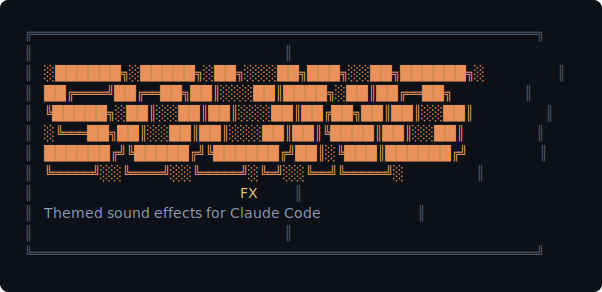

<p align="center">
  
</p>

<p align="center">
  English | <a href="./README.zh-CN.md">中文</a> | <a href="./README.ja.md">日本語</a>
</p>

> You kick off a task, switch to your browser, and forget about the terminal.
> Five minutes later you check back — it's been waiting for you the whole time.

**Sound FX** adds themed audio cues to [Claude Code](https://docs.anthropic.com/en/docs/claude-code) and [Opencode](https://opencode.ai) so you never have to babysit the terminal again. Hear when a task finishes, when something breaks, or when the AI needs your input — even while you're in another window.

Pick a single theme or go **Mix mode** and let 12 themes collide randomly. JARVIS confirms your deploy. GLaDOS mocks your errors. Pikachu celebrates your tests passing. A WoW Peon reluctantly obeys your commands.

https://github.com/user-attachments/assets/c47537fc-1c18-4256-877d-0f22d4314bfd

---

## Platform Support

Works on every major platform. No extra setup needed for local use.

| Platform | Extra setup? | How it works |
|----------|:------------:|-------------|
| **macOS** | No | Plays via `afplay` directly |
| **Windows (WSL)** | No | Auto-calls `powershell.exe` or `ffplay.exe` via WSL interop |
| **Linux desktop** | No | Auto-detects `paplay` / `ffplay` / `aplay` |
| **Remote server (SSH)** | Yes | Requires a relay script on your local machine — see below |

### Remote server setup

When running on a headless server with no audio hardware, sounds are forwarded to your local machine via a lightweight HTTP relay:

```bash
# ① Clone the repo on your LOCAL machine
git clone https://github.com/6m1w/claude-sound-fx.git

# ② Start the relay (runs in background, listens on port 19876)
python3 claude-sound-fx/scripts/relay.py &

# ③ SSH into the remote server with port forwarding
ssh -R 19876:127.0.0.1:19876 your-server

# ④ On the server, use Claude Code / Opencode as usual — sounds play locally
```

Relay commands:

```bash
python3 scripts/relay.py --status  # Show config and loaded themes
python3 scripts/relay.py --kill    # Stop the relay
```

---

## Install

### Claude Code

```
/plugin marketplace add 6m1w/claude-sound-fx
/plugin install sound-fx@claude-sound-fx
```

Then configure your theme:

```
/sound-fx:setup
```

The setup wizard will walk you through theme selection and trigger mode.

### Opencode

```bash
npm install @6m1w/opencode-sound-fx
```

Add to `opencode.json`:

```json
{
  "plugin": ["@6m1w/opencode-sound-fx"]
}
```

Shares the same config file (`~/.claude/sound-fx.local.json`) and audio themes.

### Update or Remove

Run the same command anytime:

```
/sound-fx:setup
```

The wizard will ask you to **Configure**, **Update**, or **Remove**:

| Action | What it does |
|--------|-------------|
| **Configure** | Set up or change your theme and trigger mode |
| **Update** | Re-apply current settings, refresh hooks, and play a test sound |
| **Remove** | Completely remove sound effects — deletes config file |

---

## Themes

### Sci-Fi & AI

| Theme | Vibe | Origin |
|-------|------|--------|
| **Jarvis** | *"At your service, sir."* — Calm, competent, slightly British. | Iron Man |
| **GLaDOS** | *"This was a triumph."* — Passive-aggressive AI with dark humor. | Portal |
| **Star Trek** | Classic starship interface chirps, beeps, and red alerts. | Star Trek |
| **Optimus Prime** | *"Autobots, roll out."* — Heroic commander energy. | Transformers |

### Anime

| Theme | Vibe | Origin |
|-------|------|--------|
| **JoJo** | DIO の「無駄無駄」と承太郎の「やれやれだぜ」— Dual voice chaos. | ジョジョの奇妙な冒険 |
| **One Piece** | ルフィの「よっしゃー！」— Pure rubber-band energy. | ワンピース |
| **Pikachu** | 「ピカチュウ！」— You know exactly how this sounds. | ポケットモンスター |
| **Doraemon** | 「ドラえもーん！」— The robotic cat from the future. | ドラえもん |

### Gaming & Other

| Theme | Vibe | Origin |
|-------|------|--------|
| **WoW Peon** | *"Ready to work!"* — Reluctant, overworked, relatable. | World of Warcraft |
| **StarCraft SCV** | *"SCV good to go, sir!"* — Blue-collar space worker. | StarCraft |
| **Steve Jobs** | *"One more thing..."* — Inspirational keynote energy. | Apple |
| **Mechanical Keyboard** | *clack clack clack* — Pure ASMR satisfaction. | Your dreams |

---

## How It Works

Sound FX hooks into 7 lifecycle events:

```
 SessionStart ──→ 🔊 "I am ready."         (theme: start)
 UserPromptSubmit ──→ 🔊 "Understood."      (theme: submit)
 Stop ──→ 🔊 "Task complete."               (theme: complete)
 PostToolUseFailure ──→ 🔊 "That was a mistake." (theme: error)
 Notification ──→ 🔊 "Hmm?"                 (theme: notification)
 PreCompact ──→ 🔊 "Memory failing..."      (theme: precompact)
 SessionEnd ──→ 🔊 "Until next time."       (theme: session_end)
```

> **Note:** Tool permission prompts (the approve/deny popup) are not a hookable lifecycle event in Claude Code, so this plugin cannot play sounds for them.

### Modes

| Mode | What it does |
|------|-------------|
| **Mix** (default) | Randomly picks from all 12 themes per event. Maximum chaos. |
| **Single Theme** | Sticks to one theme. For the focused individual. |

### Trigger Levels

| Level | Events |
|-------|--------|
| **Full** (default) | All 7 events fire sounds |
| **Minimal** | Only start, complete, error, notification |

Config is stored at `~/.claude/sound-fx.local.json`. Re-run `/sound-fx:setup` anytime to change.

---

## Add Your Own Theme

No code changes needed. Just add a directory under `assets/`:

```
assets/my-theme/
├── manifest.json
├── MyThemeStart1.mp3
├── MyThemeComplete1.mp3
└── ...
```

`manifest.json` format:

```json
{
  "name": "My Theme",
  "description": "What it sounds like",
  "start": ["MyThemeStart1.mp3"],
  "submit": [],
  "complete": ["MyThemeComplete1.mp3"],
  "error": [],
  "notification": [],
  "precompact": [],
  "session_end": []
}
```

Empty arrays `[]` are fine — that event just won't play a sound for your theme.

---

## Environment Variables

| Variable | Default | Description |
|----------|---------|-------------|
| `CLAUDE_SOUND_VOLUME` | `60` | Volume level (0–100) |
| `CLAUDE_SOUND_PORT` | `19876` | Relay server port |

---

## License

MIT
